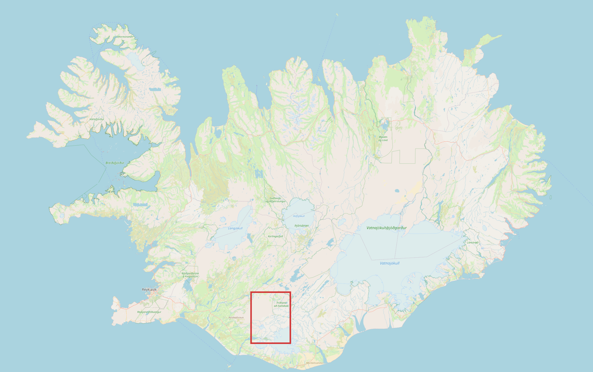
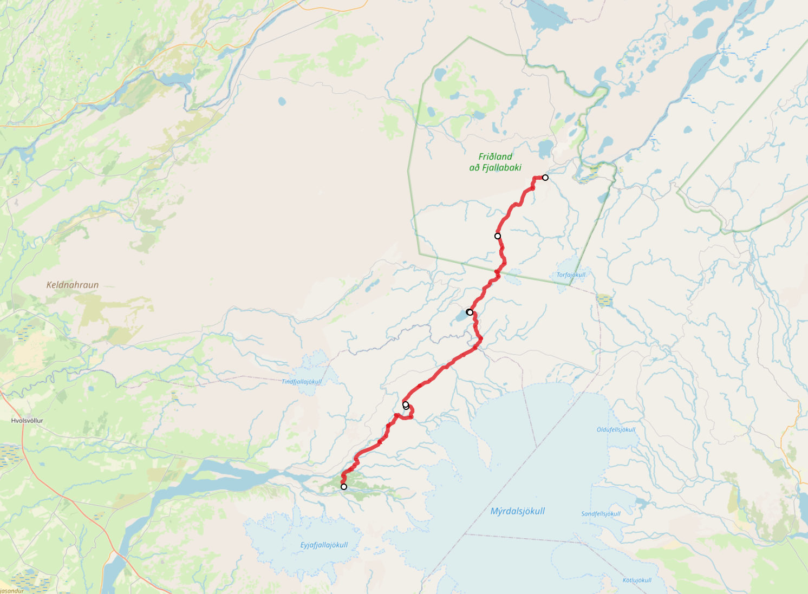
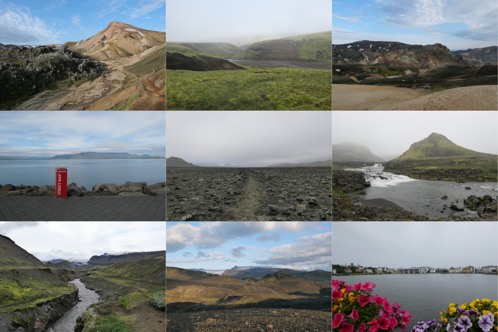

#### Motivation

 

The [Laugavegur](https://www.fi.is/en/hiking-trails/trails/laugavegur) is one of Europe's most popular through-hikes. The 54-km trail winds through diverse terrain surrounded by remarkable beauty. I completed the hike in 2025 and provide the GPX files here for free use.

#### GPX Files

* Landmannalaugur - Hrafntinnusker: [GPX File](laugavegur_gps/.gpx) (12 km)
* Hrafntinnusker - Álftavatn: [GPX File](laugavegur_gps/.gpx) (12 km)
* Álftavatn - Emstrur: [GPX File](laugavegur_gps/.gpx) (16 km)
* Emstrur - Þórsmörk: [GPX File](laugavegur_gps/.gpx) (15 km)

